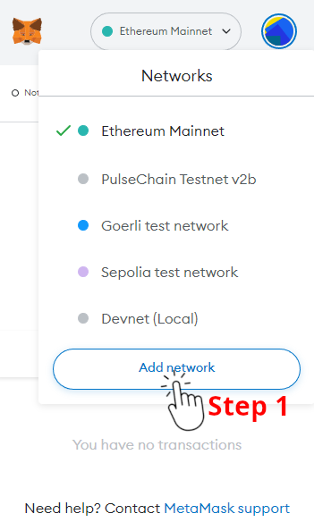
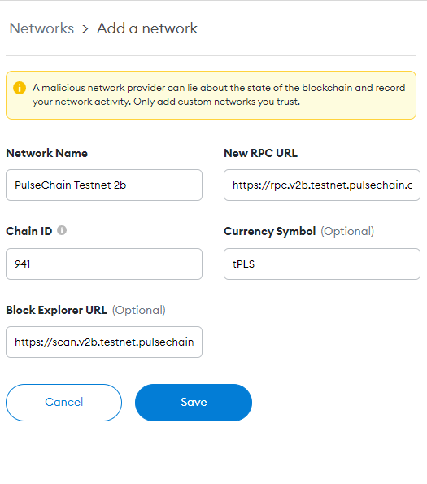
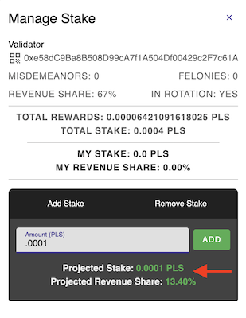
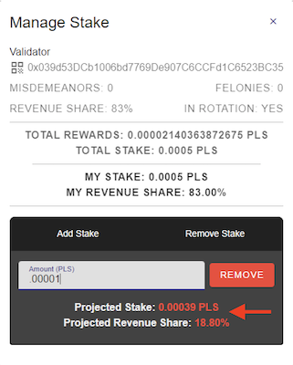

# PulseChain Testnet

The PulseChain Testnet is up and running. This document will guide you through connecting Metamask to the network and bootstrapping a PulseChain node of your own.

> **Disclaimer**: This is a **Testnet**, and issues may arise as the network or certain front-ends see increased load. The team will work diligently to address any issues as they come.

> **Disclaimer 2**: The state of this network may be reset on occasion, and nothing should be considered permanent after the fork block. We will communicate ahead of time when these resets are planned.

### Version 2b

This version of the PulseChain Testnet brings the following enhancements:
- ValidatorRotation functionality in the staking system contract has been optimized
- Includes a **beta release** of the sacrifice credit allocations
- Test run **beta release** of the AMM bot for rebalancing (UniswapV1, UniswapV2, and SushiSwap rebalanced)

## Connecting Metamask

Follow these instructions to manually add the new Testnet to your Metamask plugin. A button will be available in the future to do this automatically.

**1. Click the Networks dropdown and select "Custom Network"**

**2. Enter the following information and save (all values below are new):**
- Network Name: `PulseChain Testnet 2b`
- New RPC URL: `https://rpc.v2b.testnet.pulsechain.com`
- Chain ID: `941`
- Currency Symbol: `tPLS`
- Block Explorer URL: `https://scan.v2b.testnet.pulsechain.com`

|   Step 1    |   Step 2    |
| ----------- | ----------- |
|  |  |

**Congratulations**! You are now connected to the PulseChain Testnet. Existing ethereum accounts that had balances as of block `14,360,999` (*Mar-10-2022 07:29:19 PM +UTC*) will have the equivalent on balance on the PulseChain Testnet in addition to the **beta release** of credits awarded from the sacrifice phase.

## Getting tPLS to use on the PulseChain Testnet

To get tPLS you can use the tPLS faucet.

1. Navigate to the tPLS faucet https://faucet.v2b.testnet.pulsechain.com/
2. Connect your Metamask wallet by clicking on the button.
3. Enter the address you want to send tPLS to and click the `Request` button.
4. Wait up to 60 seconds to receive your tPLS.


## Connecting a PulseChain Node

If you were previously running a Testnet V2 node, you can re-use your existing blockchain database by rolling back the blockchain. See [Using An Existing Blockchain DB](#using-an-existing-blockchain-db) below.

> **Warning**: The PulseChain Testnet includes **all** of the Ethereum mainnet state up to block `14,360,999`. This means that the system requirements for running a node will be high, particularly the storage requirements. You should only run your own testnet node if needed for development purposes, etc...

HARDWARE
- You will need at least **800 GB** of free storage to store the synchronized chain.
- At least 4 cores and 8GB of RAM are recommended. 

SOFTWARE
- [Docker](https://docs.docker.com/get-docker/) is recommended, and the commands below will tailored to running a dockerized node. By building and running the node in docker, we eliminate any environmental differences like the local golang version or the host OS.
- If you prefer, you can compile and run the executable directly, but you will need to tweak the commands below.


> **NOTE**: All commands below assume that you want to store all chain data in a local `/blockchain` directory (must have at least **800GB** free space).
>
> If needed, you can modify the commands to mount a different directory in the docker container. To do so, you will change the **absolute path** on the **left side** of the colon `:`, e.g., `docker run -v /path/to/my/dir:/blockchain ...`
> 
> For more information see the Docker [run command reference](https://docs.docker.com/engine/reference/commandline/run/#mount-volume--v---read-only).

### 1. Prepare the Blockchain Directory

First, ensure that the intended blockchain datadir has at least 800GB of free space. The directory should be empty.

### 2. Start the Pulse Node

Once your blockchain directory is ready, you can start the node and connect to the network by providing the `--pulsechain-testnet` flag.

```shell
docker run -v /blockchain:/blockchain -P registry.gitlab.com/pulsechaincom/go-pulse --datadir=/blockchain --pulsechain-testnet
```

## Using An Existing Blockchain DB

> **Warning**: This is only valid for nodes that were sync'd with a previous version of the **PulseChain Testnet** or the **Ethereum Mainnet** past block `13,224,745`.

### 1. Stop the Existing Blockchain

Stop any existing Go-Pulse or Go-Ethereum processes and let the blockchain gracefully shut down.

### 2. Dump New Genesis File

Dump the `genesis.json` file from the latest Go-Pulse release. It is recommended you dump this file into your existing `--datadir` used by the previously running node. Assuming the `/blockchain` directory was being used, we can dump the updated `genesis.json` file with the command below.

```shell
docker run registry.gitlab.com/pulsechaincom/go-pulse --pulsechain-testnet dumpgenesis > /blockchain/genesis.json
```

Confirm that the `genesis.json` file has been written to your blockchain datadir. Double check the modified date to ensure this file was just created/updated.

### 3. Perform Rollback

In order to rollback the chain, we need to launch the geth console to issue the `debug.setHead("0xC9CB29")` command. It's important to run with the `--nodiscover` flag to prevent the node from syncing any new blocks during this process.

```shell
docker run -it registry.gitlab.com/pulsechaincom/go-pulse --pulsechain-testnet --nodiscover console
```

**From the interactive console, verify chain state and perform the rollback:**

1. Verify the current block number is above `13,224,745`
    ```shell
    > eth.blockNumber
    ```

2. Perform the chain rollback to block `13,224,745`
    ```shell
    > debug.setHead("0xC9CB29")
    ```

3. Verify the current block number is now `13,224,745` or lower
    ```shell
    > eth.blockNumber
    13224745
    ```

3. Exit the geth console
    ```shell
    > exit
    ```

### 4. Re-Initialize Genesis w/ Updated Chain Config

With the blockchain rolled back to the last ethereum mainnet block, you can now reinitialize the genesis for Testnet V2b, using the `genesis.json` file you dumped in step 2.

```shell
docker run -v /blockchain:/blockchain registry.gitlab.com/pulsechaincom/go-pulse --datadir=/blockchain init /blockchain/genesis.json
```

After the init command has completed, you can follow the normal steps above to [Start the Pulse Node](#2-start-the-pulse-node) and begin syncing from the fork block.

# Validator Registration, Rotation, and Staking

PulseChain validator registration, staking, rotation, and revenue share are managed via system contracts that can be interacted with through the [PulseChain validator & staking ui](https://stake.v2b.testnet.pulsechain.com/).

> The staking UI will require that you have Metamask configured and connected to the PulseChain Testnet. See steps above for connecting Metamask.

From the staking UI, users can:
- View information about the network validators: their total rewards, % revenue share, number of misdemeanors & felonies.
- Delegate stake to registered validators.
- Remove stake from registered validators.
- Register new validators.

## Validator Rotation

PulseChain validators are rotated at the end of each era, on a targeted ~24-hour basis, every `28,800 blocks`. On these blocks, several operations will occur:
1. Validators already in rotation for the past era will be rewarded transaction fees for blocks they produced throughout the era.
    + Earned fees are paid proportionally to the validator's stakers, based on the validator's revenue share percentage.
      > For example, if the validator has 50% revenue share, and two stakers exist with 2 and 3 tPLS delegated, then the stakers will receive 20% and 30% of the validator's rewards respectively, with the remaining 50% going directly to the validator.
2. Registered validators will be ranked by their total delegated stake.
3. The top **33 validators** will be selected as the authorized set of validators for the next era.

## Validator Staking

Users can delegate their tPLS to registered validators, earning a portion of the validator's rewards if the validator is selected for rotation. Stakers have a responsibility to delegate stake to high-performing and reliable nodes that will service the network well, and users should make informed decisions when staking. 

**Considerations when choosing validators for staking:**
1. The total stake: only the top 33 validators by total stake will be brought into rotation, and only validators in rotation will earn rewards for themselves and their stakers. Additionally, staker revenue is paid out proportionally based on your share of the total stake.
2. The number of misdemeanors & felonies represents the historical offenses/slashes that have been given to the validator for lack of uptime or bad behavior. Misdemeanor and felonies result in loss of rewards (but not principal) for the validator and its stakers.
3. The total rewards is the total amount of revenue earned by the validator over time, including revenue shared with its stakers.

> Pay attention to the user interface when adding stakes, it will show your projected stake and projected revenue share. Your projected revenue share is based on the validator's revenue share * your portion of the total stake delegated to that validator.

| Add Stake | Remove Stake | 
| --------- | ------------ |
|  |  |

**Staking rules:**
1. Stakes added to validators already in rotation will be considered "Pending" until the end of the current era (validator rotation). 
    - This means that for any given era the validator is in rotation, only the stakes that contributed to the validator being selected (staked before rotation) will be considered during revenue share.
2. Users can only remove stake from a validator after 24 hours.
3. You can add to or remove from existing stakes, and it is also possible to remove just a portion of the total stake.

## Validator Registration

Running a validator node performs an important role for the PulseChain network, and the performance of the network depends on the performance of its underlying validators.

**Users should not consider running a validator node unless you have experience running a full blockchain node with high availability!**

> **Before Registering:** You should have the validator node running and fully synchronized with the network so that the moment the validator is brought into rotation it is ready to sign blocks for the network.
>
> ***Once again: only register a validator if you are fully committed to maintaining its availability and uptime - THIS IS NOT FOR MOST USERS!***

With the above caveats understood, you can register the validator through the [PulseChain validator & staking ui](https://stake.v2b.testnet.pulsechain.com/). Steps for doing so include:

1. Making a **non-refundable deposit of 500,000 tPLS** to the staking contract from the validator address. This serves to prevent spam registrations.
> **About the Deposit:** This is intentionally high during the Testnet phase to limit the number of 3rd party validators and ensure network availability and performance. If you have serious intentions of running a high-availability validator for testnet, please reach out to the PulseChain team via Telegram, and we can assist with funding via the Testnet treasury account.

2. Register the new validator with the following options:
    - Fee Address (Optional): If provided, rewards earned by the validator will be sent to the fee address. If not provided, the fees are paid directly to the validator address.
    - Revenue Share: The percent of revenue that will be paid out to users with stake delegated to this validator.
        + Considerations: higher revenue share encourages more stakers, lower revenue share captures a higher share of profits for the validator.

### Unregister a Validator

Validators looking to cease operation can un-register themselves via the same [PulseChain validator & staking ui](https://stake.v2b.testnet.pulsechain.com/). An un-registered validator will be removed from the validator pool at the next validator rotation.
> A validator can be re-registered without requiring a new deposit.
